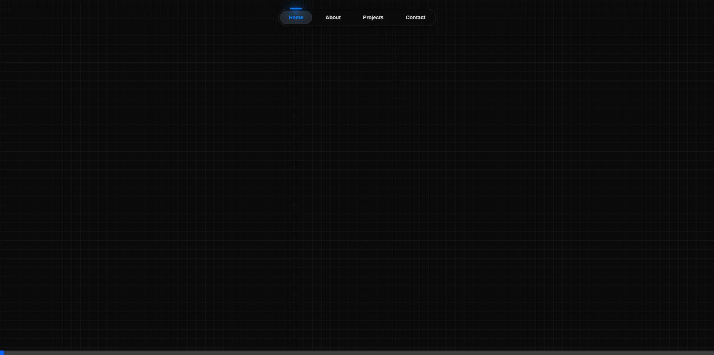

# 🚀 Ishan-Portfolio


Official portfolio of Ishan Chakraborty - QA Engineer & AI/ML Specialist. Showcasing projects in AI, Automation, and Web Development.



## ✨ Features

*   **Cinematic Dark Mode**: Premium dark theme with glassmorphism and subtle grain effects.
*   **Tubelight Navbar**: Floating, glowing navigation bar with active state animations.
*   **Interactive Hero**: Text scramble effects and sparkling text animations.
*   **Bento Grid Projects**: Responsive grid layout for showcasing projects with realistic thumbnails and hover effects.
*   **Experience Timeline**: Vertical timeline with glowing nodes and continuous gradient line.
*   **Animated Skills**: Hover-interactive skill badges grouped by category.
*   **Contact Section**: Dedicated contact area with "Background Beams" effect.
*   **Performance**: Optimized with Vite for lightning-fast HMR and build times.

## 🛠️ Tech Stack

*   **Core**: React 19, Vite
*   **Styling**: Tailwind CSS v3, `clsx`, `tailwind-merge`
*   **Animations**: Framer Motion
*   **Icons**: Lucide React
*   **Deployment**: GitHub Pages

## 📂 Project Structure

```
ishan-portfolio/
├── public/              # Static assets (favicons, images)
├── src/
│   ├── assets/          # Project images and global assets
│   ├── components/      # Reusable UI components
│   │   ├── ui/          # Generic UI primitives (BentoGrid, Navbar, etc.)
│   │   └── ...          # Section-specific components (Hero, About, etc.)
│   ├── data/            # Static data content (resume.js)
│   ├── lib/             # Utility functions (utils.js)
│   ├── App.jsx          # Main application component
│   └── main.jsx         # Entry point
├── .gitignore           # Git ignore rules
├── index.html           # HTML entry point
├── package.json         # Dependencies and scripts
├── vite.config.js       # Vite configuration
└── tailwind.config.js   # Tailwind configuration
```

## 🚀 Getting Started

1.  **Clone the repository:**
    ```bash
    git clone https://github.com/Ishan96Dev/ishan-portfolio.git
    cd ishan-portfolio
    ```

2.  **Install dependencies:**
    ```bash
    npm install
    ```

3.  **Run the development server:**
    ```bash
    npm run dev
    ```
    Open [http://localhost:5173](http://localhost:5173) to view it in the browser.

## 📦 Deployment

This project is configured for deployment to **GitHub Pages**.

1.  **Update Configuration:**
    *   Open `vite.config.js` and ensure the `base` property matches your repository name (e.g., `/ishan-portfolio/`).
    *   Open `package.json` and update the `homepage` URL.

2.  **Deploy:**
    ```bash
    npm run deploy
    ```
    This command will build the project and push the `dist` folder to the `gh-pages` branch.

## 📝 Customization

*   **Content**: Edit `src/data/resume.js` to update your personal information, experience, and projects.
*   **Images**: Place new images in `src/assets/` and import them in `resume.js`.
*   **Styles**: Modify `src/index.css` or `tailwind.config.js` for global style changes.

## 📄 License

This project is licensed under the MIT License - see the [LICENSE](LICENSE) file for details.

---
Built with ❤️ by [Ishan Chakraborty](https://github.com/Ishan96Dev)
