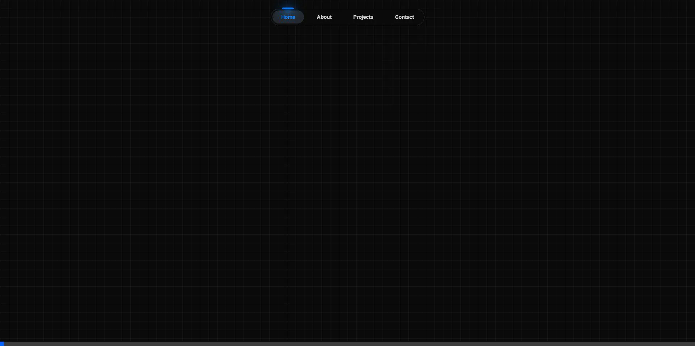

#  Ishan Chakraborty - Portfolio

>  **Live Site**: [ishan-portfolio.vercel.app](https://ishan-portfolio-blond.vercel.app/)

[](https://ishan-portfolio.vercel.app/)


Official portfolio of Ishan Chakraborty - QA Engineer & AI/ML Testing Specialist. Showcasing expertise in AI/ML testing, automation frameworks, and modern web development.

##  Features

*   **SEO Optimised**: Server-side rendering via Next.js — full `<meta>`, Open Graph, Twitter cards, JSON-LD structured data, `robots.txt` and `sitemap.xml`
*   **Cinematic Dark Mode**: Premium dark theme with glassmorphism and subtle grain effects
*   **Custom Scrollbar**: Themed gradient scrollbar with smooth teal-to-cyan design
*   **Tubelight Navbar**: Floating, glowing navigation bar with active state animations
*   **Interactive Hero**: Text scramble effects and sparkling text animations
*   **Bento Grid Projects**: 8 featured projects with custom-generated thumbnails and hover effects
*   **Experience Timeline**: Vertical timeline with company logos, glowing pulse animations, and smooth scroll effects
*   **Working Contact Form**: Functional contact form with validation and email integration
*   **Animated Skills**: Hover-interactive skill badges grouped by AI/ML & Testing categories
*   **Professional Branding**: Real company logos for Katonic.ai and Sectona

##  Recent Updates

*    Migrated from GitHub Pages static export to **Vercel with full SSR** support
*    Migrated from Vite (CSR) to **Next.js 15** for full SEO support
*    Added Open Graph, Twitter cards, canonical URL, and JSON-LD Person schema
*    Added `robots.txt` and `sitemap.xml`
*    Fixed memory leak in sparkles animation (AnimatePresence + Page Visibility API)
*    Fixed interval cleanup leak in text scramble animation
*    Added 4 new projects from GitHub repositories with AI-generated thumbnails
*    Integrated company logos (Katonic.ai, Sectona)
*    Implemented working contact form with validation
*    Added custom themed scrollbar with gradient effects

##  Tech Stack

*   **Core**: React 19, Next.js 15
*   **Rendering**: Server-Side Rendering (SSR) — deployed on Vercel
*   **Styling**: Tailwind CSS v3, `clsx`, `tailwind-merge`
*   **Animations**: Framer Motion
*   **Icons**: Lucide React
*   **Deployment**: Vercel (auto-deploy on every push to `main`)

##  Project Structure

```
ishan-portfolio/
 app/                 # Next.js App Router
    layout.jsx       # Root layout — SEO metadata, JSON-LD, global CSS
    page.jsx         # Home page (server component)
    globals.css      # Global styles, CSS variables, custom scrollbar
 public/              # Static assets served as-is
    favicon.svg
    robots.txt
    sitemap.xml
 src/
    assets/          # Project images and global assets
       logos/       # Company logos (Katonic.ai, Sectona)
       *.png        # Project thumbnails and profile images
    components/      # UI components (all 'use client')
       ui/          # Generic UI primitives (BentoGrid, Navbar, Footer, etc.)
       hero-section.jsx
       about-section.jsx
       experience-section.jsx
       projects-section.jsx
       contact-section.jsx
    data/            # Static data content (resume.js)
    lib/             # Utility functions (utils.js)
 .github/
    workflows/
        deploy.yml   # CI: build check on push/PR (Vercel handles deployment)
 .gitignore
 jsconfig.json        # Path alias (@/*  src/*)
 next.config.js       # Next.js config
 tailwind.config.js
 postcss.config.js
 package.json
```

##  Getting Started

1.  **Clone the repository:**
    ```bash
    git clone https://github.com/Ishan96Dev/ishan-portfolio.git
    cd ishan-portfolio
    ```

2.  **Install dependencies:**
    ```bash
    npm install
    ```

3.  **Run the development server:**
    ```bash
    npm run dev
    ```
    Open [http://localhost:3000](http://localhost:3000) to view it in the browser.

##  Deployment

This project is deployed on **Vercel** with automatic CI/CD via Vercel's GitHub integration.

### Vercel Deployment (recommended)

1.  Go to [vercel.com/new](https://vercel.com/new) and import your GitHub repository
2.  Vercel auto-detects Next.js — no configuration needed
3.  Click **Deploy** — done!

Every push to `main` triggers an automatic production deployment. Pull requests get preview URLs automatically.

### After Deploying

If your Vercel project URL differs from `ishan-portfolio.vercel.app`, update:
*   `metadataBase` in `app/layout.jsx`
*   `<loc>` in `public/sitemap.xml`
*   `Sitemap:` in `public/robots.txt`

##  Customization

### Update Content
*   **Personal Info**: Edit `src/data/resume.js` to update name, title, contact details
*   **SEO Metadata**: Edit `app/layout.jsx` — `metadata` export and JSON-LD block
*   **Experience**: Add/modify work experience with company logos in `resume.js`
*   **Projects**: Update projects array with new GitHub repositories
*   **Skills**: Customize skill categories and technologies in `resume.js`

### Add Assets
*   **Project Images**: Place in `src/assets/` (PNG format recommended)
*   **Company Logos**: Add to `src/assets/logos/` for experience section
*   **Profile Image**: Replace `src/assets/profile.jpg`

### Modify Styles
*   **Global Styles**: Edit `app/globals.css` for scrollbar, fonts, utilities
*   **Theme Colors**: Update CSS variables in `app/globals.css` (`:root` section)
*   **Tailwind Config**: Modify `tailwind.config.js` for theme extensions

##  Contributing

Contributions, issues, and feature requests are welcome! Feel free to check the [issues page](https://github.com/Ishan96Dev/ishan-portfolio/issues).

##  License

This project is licensed under the MIT License - see the [LICENSE](LICENSE) file for details.

##  Contact

- **Email**: ishanchakraborty2496@gmail.com
- **LinkedIn**: [Ishan Chakraborty](https://www.linkedin.com/in/ishan-chakraborty-0085571a1)
- **GitHub**: [@Ishan96Dev](https://github.com/Ishan96Dev)

---

**Built with  by [Ishan Chakraborty](https://github.com/Ishan96Dev)**
